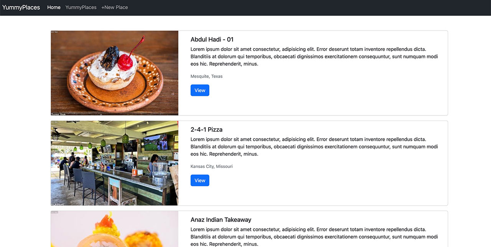
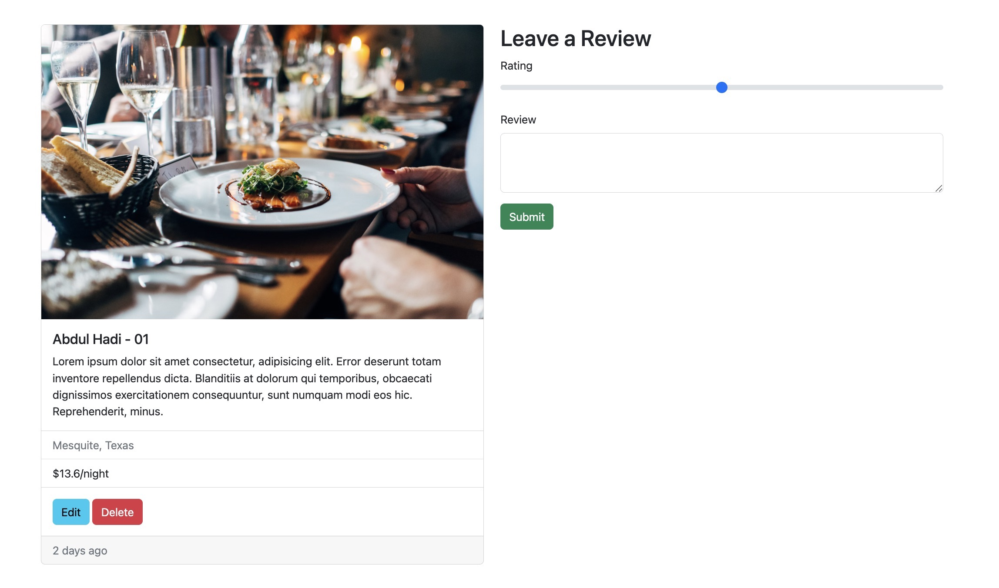
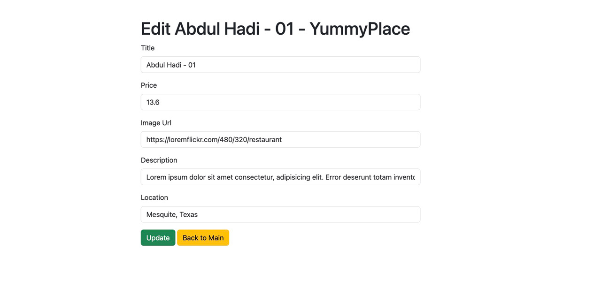

<div>
  <h1 align="center">Yummyplace App - A list of restaurant - in Express 🧑‍💻 </h1>
<h2 style="">Goals:</h2>
  <ul>
  <li>
  Creating Server With Express
  </li>
      <li>
Creating Dynamic HTML With Templating (EJS)
  </li>
      <li>
Defining RESTful Routes
  </li>
      <li>
MongoDB - Mongoose - C.R.U.D
  </li>
      <li>
Mongo Relationships With Express
  </li>
      <li>
 Using Bcrypt for authentication (with salt)
  </li>
        <li>
 Error handling in express
  </li>
        <li>
Using Bootstrap Styling
  </li>
        <li>
Express Router & Cookies  
</li>
        <li>
Express Session and Flash  
</li>


   </ul>

  <p>
    Screenshots:
  </p>
  <h3>
  Home Page
  
    </h3>
  <h3>
View Place / Leave a Review
  
    </h3>
  <h3>
  Edit Place
  
    </h3>
</div>

<hr />

## Requirements
- connect-flash:0.1.1
- ejs:3.1.8
- ejs-mate:4.0.0
- express:4.18.2
- express-session:1.17.3
- joi:17.7.0
- method-override:3.0.0
- mongoose:6.7.3
- unsplash:4.2.0


## Installation

This is a [Node.js](https://nodejs.org/en/) module available through the
[npm registry](https://www.npmjs.com/).

Before installing, [download and install Node.js](https://nodejs.org/en/download/).
Node.js 0.10 or higher is required.

If this is a brand new project, make sure to create a `package.json` first with
the [`npm init` command](https://docs.npmjs.com/creating-a-package-json-file).

Installation is done using the
[`npm install` command](https://docs.npmjs.com/getting-started/installing-npm-packages-locally):

```console
$ npm install express
```

Follow [our installing guide](http://expressjs.com/en/starter/installing.html)
for more information.

## Quick Start

- DB configuration is in index.js

```javascript
mongoose.connect('mongodb://localhost:27017/yummyplaces', {
})
const db = mongoose.connection

db.on("error", () => { console.log(`mongoose connection error`) })
db.once("open", () => {
    console.log("connection is open")
})
```

### `node install`
### `node index.js`

open localhost:8080 in your browser